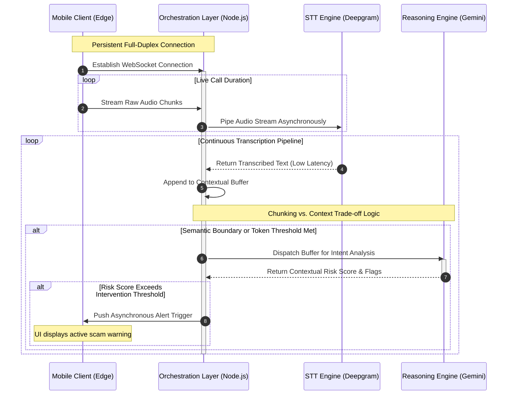

# CallShield-AI: Real-Time Voice Phishing Detection using STT + LLM Pipelines

## Overview

CallShield-AI is a real-time voice phishing detection prototype that analyzes
live phone conversations using speech-to-text and large language models.

The system evaluates conversational semantics during calls to detect
social engineering patterns such as urgency manipulation, authority
impersonation, and financial information requests.

Key components:

• Speech-to-Text streaming using Deepgram  
• Contextual reasoning using Gemini LLM  
• WebSocket-based asynchronous pipeline  
• Real-time scam alerts to the user

Current performance:

<3s detection latency    |    ~90% detection rate on simulated scam scenarios

---

### System Architecture

The system operates as a streaming pipeline where live call audio is transcribed in real time and analyzed by an LLM for social-engineering intent before triggering user alerts.


---

#### Architectural Design Principles

| Principle | Implementation |
| :--- | :--- |
| **Decoupled layers** | Each layer (telephony, orchestration, STT, LLM, client) communicates through well-defined interfaces (REST + WebSocket), enabling independent replacement or scaling of any single component. |
| **Asynchronous, non-blocking I/O** | Node.js event loop + WebSocket streams ensure audio ingestion never stalls while awaiting STT or LLM responses. |
| **Dual-channel STT** | Two independent Deepgram connections process the caller (inbound) and callee (outbound) tracks simultaneously, preserving per-speaker context for the reasoning engine. |
| **Rolling context window** | A 15-sentence sliding buffer passed to Gemini provides sufficient conversational context without unbounded token growth, preventing API quota exhaustion. |
| **Schema-enforced LLM output** | Gemini's `responseSchema` constraint forces structured JSON (`scam_probability`, `flagged_tactics`, `explanation`), eliminating brittle text-parsing logic. |
| **Smart Alert Engine (client-side)** | Progressive cooldown and escalation rules on the Flutter side prevent alert fatigue while guaranteeing immediate notification on threat escalation (SUSPICIOUS → CRITICAL). |
| **Bidirectional control channel** | The Flutter app sends `pause_monitoring` / `resume_monitoring` commands back up the WebSocket, creating a bidirectional control plane over a single persistent connection. |

---

#### Technology Stack

| Layer | Technology | Justification |
| :--- | :--- | :--- |
| Telephony Gateway | **Twilio Programmable Voice** | Industry-standard PSTN programmability; supports real-time media streaming (`<Stream>`) natively. |
| Backend Orchestration | **Node.js + Express + ws** | Non-blocking event loop ideal for high-throughput I/O; minimal overhead for WebSocket bridging. |
| Speech-to-Text | **Deepgram Nova-2** | Sub-300 ms real-time transcription with μ-law 8 kHz support matching Twilio's codec directly. |
| AI Reasoning | **Gemini 2.5 Flash** | Low-latency, instruction-following LLM with native structured-output (JSON schema) enforcement. |
| Mobile Client | **Flutter (Android)** | Cross-platform Dart framework; `dash_bubble` enables persistent overlay monitoring during calls. |
| Local Persistence | **Flutter SharedPreferences** | Lightweight key-value store sufficient for alert history; no external database dependency. |

---

#### Repository Structure

```
CallShield-AI/
├── callshield_backend/          # Node.js orchestration server
│   ├── server.js                # HTTP + WebSocket entry point
│   ├── state.js                 # Global monitoring toggle
│   ├── routes/
│   │   └── callRoutes.js        # POST /api/call, POST /api/twiml
│   ├── controllers/
│   │   └── callController.js    # Twilio call initiation & TwiML generation
│   └── services/
│       └── streamHandler.js     # Deepgram bridging, context buffer, Gemini dispatch
│
└── callshield_app/              # Flutter Android application
    └── lib/
        ├── main.dart            # Alert UI + floating bubble
        ├── history_screen.dart  # Persistent alert log
        └── services/
            ├── alert_service.dart         # WebSocket client + stream controller
            ├── smart_alert_engine.dart    # Cooldown & escalation logic
            ├── hardware_alert_service.dart# Vibration + notification triggers
            └── storage_service.dart       # Local alert persistence
```

---

### Key Engineering Challenges

| Challenge | Implication | Architectural Mitigation |
| :--- | :--- | :--- |
| **End-to-End Latency** | Sequential processing of audio, transcription, and inference creates a "latency bottleneck," rendering mid-call intervention impossible. | Implementation of a concurrent pipelining strategy. The STT engine feeds a buffer that the LLM analyzes asynchronously, prioritizing chunked context over full-sentence completion. |
| **Context vs. Overhead** | Sending every transcribed word to the LLM exhausts API quotas and token limits; waiting for long pauses risks missing the intervention window. | Dynamic token-window logic that triggers intent analysis cycles based on semantic boundary markers rather than strict time intervals. |
| **Accuracy Trade-offs** | Aggressive filtering yields False Positives (interrupting safe calls); passive filtering yields False Negatives (allowing scams to proceed). | Tunable heuristic thresholding, prioritizing the mitigation of False Negatives while utilizing a multi-tiered alerting system for the end-user. |

---

### Methodology: Heuristic Logic & Scam Indicators
The detection mechanism moves beyond static filtering by employing heuristic logic mapped to established social engineering frameworks. The reasoning engine continuously evaluates the conversational transcript against a matrix of psychological triggers:

* **Artificial Urgency & Coercion:** Detecting semantic patterns designed to bypass logical reasoning, such as artificial time constraints, threats of legal action, or account suspension warnings.
* **Financial & Data Requests:** Flagging unwarranted transitions toward the extraction of sensitive information (e.g., OTPs, bank routing numbers) or immediate financial transfers.
* **Authority Impersonation:** Analyzing the dialogue for contextual inconsistencies common when callers attempt to masquerade as government officials, bank representatives, or technical support.

---

### Evaluation Strategy: 
To rigorously validate the pipeline's detection capabilities and latency constraints, the system was benchmarked against varied simulated scam taxonomies. 

| Scenario | Success Rate | Avg. Detection Latency |
| :--- | :--- | :--- |
| **Banking/KYC Scam** | 100% (5/5) | 2.3 Seconds |
| **Lottery/Prize Scam** | 80% (4/5) | 3.1 Seconds |
| **Normal/Benign Call** | 100% (5/5) | N/A (No False Alarms) |

---

### Demo & UI


*Figure 2: Real-time alert triggered when the system detects a 'Sense of Urgency' combined with a 'Financial Request'.*

<br>


*Figure 3: Mobile interface of the Threat Dashboard displaying high-confidence alerts (99%+ match) generated by the reasoning engine in response to severe coercion and OTP requests.*

### Future Research Directions
1.  **On-device tinyML Inference:** Transitioning the initial classification layer to edge devices to drastically reduce latency and preserve user privacy by minimizing cloud reliance for benign calls.
2.  **Multi-lingual Support for Regional Dialects:** Expanding the STT and LLM pipelines to natively process code-mixed languages and regional dialects (e.g., Hindi-English) critical for deployment in the Indian telecommunications landscape.
3.  **Acoustic Feature Integration:** Augmenting the semantic text analysis with parallel acoustic evaluation to detect vocal stress, synthetic voice generation (deepfakes), and abnormal cadences.
